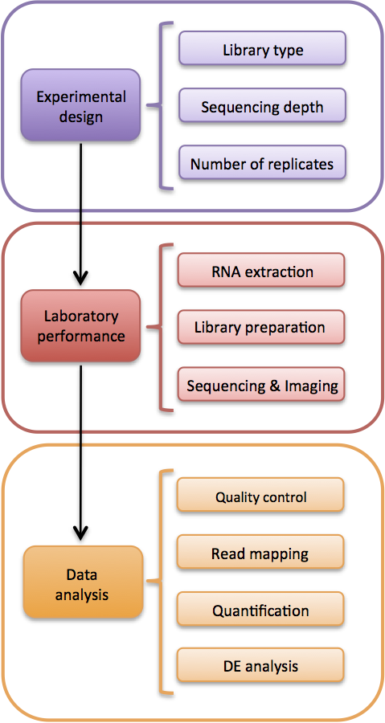

```{r global_options, include=FALSE}
knitr::opts_chunk$set(fig.pos = 'H')
require(float)
```

# Abstract

Este análisis se basa en el estudio de expresión de 30 muestras de RNA-seq pertenecientes al tejido tiroides con el fin de comparar los tres tipos de infiltración medio: not infiltrated tissues (NIT), small focal infiltrates (SFI) y extensive lymphoid infiltrates (ELI). 
Los datos han sido obtenidos gracias al proyecto The Genotype-Tissue Expression (GTEx), el cual es una base de datos pública para estudiar la expresión génica y la regulación de tejidos. En esta fuente de datos se recogen muestras de 54 tejidos no enfermo en aproximadamente 1000 individuos para llevar a cabo diferentes ensayos moleculares.

Los datos y el código completo del análisis se encuentran en el siguiente __repositorio github__ [https://github.com/marinabf93/Analisis-Expresion-RNAseq.git]

# Objetivos

Para este análisis he marcado dos objetivos bien diferenciados:

a) Comparar los tres grupos entre sí e identificar los genes más significativos diferencialmente expresados en cada comparación con sus correspondientes anotaciones.

b) Identificar los procesos biológicos, componentes celulares o funciones molesculares más afectados o implicados en el estudio.

# Materiales

La razón de este trabajo es analizar bioinformáticamente los datos de un experimento con RNA-seq. Los datos en el que se ha basado el análisis han sido aportados junto al enunciado de la PEC pero pertenecen al portal GTEx (https://www.gtexportal.org/home/) [@lonsdale2013genotype]

Dentro de los distintos paquetes existentes para el análisis de RNA-seq, he escogido el __paquete edgeR__ para realizar el análisis [@robinson2010edger]. El material en el que he basado todo mi análisis ha sido la guía de utilización del paquete edgeR: "edgeR: differential expression analysis of digital gene expression data" (http://www.bioconductor.org/packages/release/bioc/vignettes/edgeR/inst/doc/edgeRUsersGuide.pdf)

## Diseño experimental

El __tipo de experimento__ corresponde al análisis de RNA-seq, donde a través del diseño de un experimento se intenta responder a los objetivos planteados. Con el uso de la estadística y las diferentes herramientas bioinformáticas, se pretende procesar, analizar, visualizar y analizar los datos con el fin de responder a las cuestiones biológicas de partida.

El punto de partida de un experimento de ARN-Seq es un conjunto de muestras de ARN, típicamente asociadas con una variedad de condiciones de tratamiento. Cada muestra se secuencia, se asignan lecturas cortas al genoma apropiado y se registra el número de lecturas asignadas a cada característica genómica de interés. El conjunto de recuentos genéticos de cada muestra constituye la librería de expresión de esa muestra. El tamaño esperado de cada recuento es el producto del tamaño de la librería y la abundancia relativa de ese gen en esa muestra.

El paquete que he elegido ( __edgeR__ ) trabaja en una tabla de recuentos de lectura de números enteros, con filas correspondientes a los genes y columnas a las librerías independientes. Los recuentos representan el número total de lecturas alineadas a cada gen (u otro locus genómico).Esos recuentos pueden producirse a partir de lecturas alineadas por una variedad de herramientas de software de lectura corta. 

Las lecturas pueden ser contadas de varias maneras. Cuando se realizan análisis a nivel genético, los conteos podrían ser para mapear lecturas en cualquier lugar del rango genómico del gen, como en este análisis, o los conteos podrían ser sólo para exones. Normalmente contamos lecturas que se superponen a cualquier exón para el gen dado, incluyendo el UTR como parte del primer exón.

## Datos

En el caso particular de este análisis se parte directamente de los __datos de conteo__ en forma de una tabla rectangular de valores enteros. La celda de la tabla en la fila g-ésima y la columna j-ésima de la tabla indica cuántas lecturas se han asignado al gen g en la muestra j.

Además de la tabla con los datos de conteo, se aporta una tabla llamada __targets__ con toda la información necesaria relativa al estudio: el ID del experimento, el nombre de las muestras, el grupo al que pertenecen, el tipo de dato molecular, etc.
Ambos datos han sido aportados por el profesor de la asignatura "Análisis de datos ómicos" de la UOC.

## Software 

Para comenzar el análisis se necesita instalar __R statistical software__ el cual permite hacer análisis estadísticos, representaciones gráficas y lectura y creación de documentos en diferentes formatos. El software se puede descargar en la página web [https://cran.r-project.org/index.html] y solo deben seguirse las instrucciones indicadas en función del tipo de software del ordenador que se utilice para el análisis. 

El análisis de RNA-seq que se presenta en este informe ha sido desarrollado con la versión 3.6.2 y todos los análisis se han llevado a cabo con la interfaz _RStudio_. Esta interfaz puede descargarse desde la página principal [https://www.rstudio.com/] 

# Métodos: Procedimiento general del análisis ("Workflow")

El flujo de trabajo se resumen en la siguiente imagen "Workflow.png" dentro del directorio __figures__.

```{r fig.cap="Worflow RNA-seq análisis.", echo=FALSE, out.extra='', fig.height=5, fig.width=5, fig.align="center"}

```


A continuación resumiré de forma muy general los métodos utilizados en cada paso del flujo de trabajo. El desarrollo detallado de cada paso del análisis lo encontraréis en el archivo __Pipeline del análisis RNA-seq.Rmd__ dentro del directorio principal del repositorio github indicado al inicio de este informe.

Antes de empezar con el análisis y a manejar la enorme cantidad de datos y ficheros que ello conlleva, crearé tres carpetas para la organización del mismo: 

  + La carpeta principal del análisis será "Analisis-Expresion-RNAseq", la cual también será mi directorio de trabajo.
  + Una carpeta llamada __data__ para almecenar todo tipo de datos del experimento y en los cuales basaré mi análisis. En esta carpeta guardaré los archivos _counts_ y el archivo _targets_, en el cual se decribirán los factores de estudio y sus niveles.
  + En la carpeta __results__ guardaré todos los resultados obtenidos en el análisis.
  + La carpeta __figures__ servirá para almacenar todo tipo de imágenes y figuras generadas durante el análisis.
  
  
## Definición de los datos

El primer paso es leer los archivos __counts.csv__ y __targets.csv__ aportados junto el enunciado de la PEC, ambos archivos están ubicados en una la carpeta __data__ en el directorio principal de trabajo.

El archivo _targets.csv_ es un resumen de cada experinecia donde aparecen informaciones como el grupo, sexo o nombre de la muestra. La columna _group_ de este archivo nos informa de los tres grupos de muestras existentes:

  -Not infiltrated tissues (NIT)
  -Small focal infiltrates (SFI)
  -Extensive lymphoid infiltrates (ELI)
  
El archivo _counts.csv_ contiene en sus columnas el nombre de las 292 muestras y cada fila pertenece a un gen diferente.

```{r lectura de los archivos, include=FALSE}
library(readr)
targets <- read_csv("./data/targets.csv")
library(edgeR)
counts <- readTargets("./data/counts.csv", sep=";")

#Eliminación de la version ENSEMBL
counts$X <- gsub("\\..*", "", counts$X, fixed = FALSE)
```

El siguiente paso fue escoger 30 muestras dentro de las 292 muestras posibles, de manera que tenga 10 muestras de cada uno de los tres grupos de tiroides. Para llevar a cabo esto, necesito seleccionar primero 10 muestras de cada grupo a través de la columna _group_ del archivo __targets.csv__. 

```{r Selección de las 30 muestras}
library(dplyr)
group_NIT<-subset(targets, Group=="NIT")[1:10,]
group_SFI<-subset(targets, Group=="SFI")[1:10,]
group_ELI<-subset(targets, Group=="ELI")[1:10,]

#Unimos los tres data frame creados en uno solo
targets_30<-Reduce(function(...) merge(...,all=TRUE), list(group_NIT, group_SFI, group_ELI))
```

Una vez he escogido las 30 muestras, extraigo las columnas correspondientes (en el archivo __counts.csv__) a esas 30 filas seleccionadas para finalmente obtener el archivo __counts_30__. Este archivo contiene las 30 muestras con 56202 observaciones (genes) y será la base de todo el análisis. A continuación se muestran las 5 primeras muestras de este archivo.

```{r Extracción de las 30 filas seleccionadas anteriormente, include=FALSE}
#Extraigo los nombres de la columna Sample_Name
nombres<- sort(targets_30$Sample_Name)
#Copio y modifico los nombres anteriores en el siguiente comando para
#seleccionar las 30 columnas en counts
counts_30<-counts[ , c("GTEX.111CU.0226.SM.5GZXC", "GTEX.111FC.1026.SM.5GZX1", "GTEX.111VG.0526.SM.5N9BW", "GTEX.111YS.0726.SM.5GZY8", "GTEX.1122O.0226.SM.5N9DA", "GTEX.1128S.0126.SM.5H12S", "GTEX.113JC.0126.SM.5EGJW", "GTEX.117XS.0526.SM.5987Q", "GTEX.117YW.0126.SM.5EGGN", "GTEX.117YX.1226.SM.5H11S", "GTEX.1192W.0126.SM.5EGGS", "GTEX.1192X.1126.SM.5EGGU", "GTEX.11DXY.0426.SM.5H12R", "GTEX.11EQ8.0826.SM.5N9FG", "GTEX.11EQ9.0626.SM.5A5K1", "GTEX.11GS4.0826.SM.5986J", "GTEX.11NV4.0626.SM.5N9BR", "GTEX.11O72.2326.SM.5BC7H", "GTEX.11TUW.0226.SM.5LU8X", "GTEX.11XUK.0226.SM.5EQLW", "GTEX.1211K.0726.SM.5FQUW", "GTEX.12584.0826.SM.5FQSK", "GTEX.12BJ1.0426.SM.5FQSO", "GTEX.13NZ9.1126.SM.5MR37", "GTEX.13QJC.0826.SM.5RQKC", "GTEX.14ABY.0926.SM.5Q5DY", "GTEX.14AS3.0226.SM.5Q5B6", "GTEX.14BMU.0226.SM.5S2QA", "GTEX.PLZ4.1226.SM.2I5FE",  "GTEX.R55G.0726.SM.2TC6J")]
#Creo el objeto group para recopilar el grupo al que pertenece cada muestra 
group<- c("NIT","NIT","ELI","NIT","NIT","NIT","NIT","NIT","SFI","NIT","NIT","NIT","SFI","SFI","SFI","SFI","ELI","SFI","SFI","ELI","SFI","SFI","SFI","ELI","ELI","ELI","ELI","ELI","ELI","ELI")
```

```{r Lectura archivo counts30, echo=FALSE}
head(counts_30, 5)
```

## Filtración de los genes

Filtraré los genes reteniendo sólo aquellos genes que se expresen en todas las muestras y con un número mínimo de contajes. El proceso de filtraje es muy importante ya que los genes con recuentos muy bajos en las librerías no proporcionan apenas pruebas de expresión diferencial y, además, interfieren de forma negativa en algunas aproximaciones estadísticas. En consecuecia, estos genes con bajos conteos reducen el poder de detección de los genes de expresión diferencial y por ello es importante eliminarlos.
Para llevar a cabo el filtraje necesito primero descargar el paquete __edgeR__ de Bioconductor.

```{r Descarga del paquete edgeR, include=FALSE}
BiocManager::install("edgeR")
```

Hay distintas formas de filtrar los genes de baja expresión pero antes se deben transformar los conteos con el fin de tener en una misma escala todas las muestras de un mismo estudio y evitar, así, diferencias debido al distinto tamaño de las librerías.

En este estudio por cada grupo existen 10 réplicas biológicas, ya que el tamaño de muestra de cada grupo es 10. Por este motivo, estableceré un umbral mínimo de conteos por millón (CPM) en al menos 10 muestras; es decir, favoreceré un filtraje donde los genes estén representados al menos una vez en todas las muestras en cada grupo.

El segundo umbral que puedo marcar para el filtraje es un mínimo de conteos por millón para cada gen. Para obtener el número de conteos por millón utilizaré la función __cpm__ del paquete _edgeR_. Esta función permite convertir los contajes a CPMs, por lo tanto, se están normalizando los conteos para las diferentes profundidades de secuenciación de cada muestra.

```{r Obtención de los CPMs, include=FALSE}
myCPM <- cpm(counts_30)
head(myCPM)
```

Por regla general, se puede elegir un buen umbral mínimo de CPMs identificando el CPM que corresponde a un conteo de 10. Contrastando las tablas __counts_30__ y __myCPM__, se observa que el umbral en este caso es aproximadamente 0,15. Con la selección de genes que superen el umbral de 0,15 se obtiene una matriz lógica con los genes que han superado el umbral (TRUE) y los genes que estan por debajo del umbral (FALSE). Se muestran los resultados de los tres primeros genes para la superación o no de dicho umbral.

```{r selecciòn de genes con el umbral myCPM>0.15, include=FALSE}
# Seleccionamos los valores CPM mayores al umbral
thresh <- myCPM > 0.15
# Se crea una matriz lógica de TRUE y FALSE
table1<-head(thresh, 3)
```

```{r Tabla1}
knitr::kable(
  table1, booktabs = TRUE,
  caption = 'Matriz lógica donde se recogen como TRUE los genes que superan CPM > 0.15 y como FALSE los genes que no superan dicho umbral.')
```

Una vez he filtrado los genes, hago un resumen con los genes que tienen un valor CPM superior al valor umbral. Dentro de los genes seleccionados como _TRUE_, seleccionaré los genes que tienen al menos 10 valores TRUE para cada gen; es decir, me quedaré con los genes que tengan representación en todas las muestras del grupo.

Los genes que superen los dos umbrales se seleccionan y recogen en el objeto _counts.keep_ y estos serán los únicos conteos que conservaré para posteriores análisis. En este caso partimos de 56202 genes y tan solo conservaré 22990 genes tras la filtración.

```{r Selección de genes que superen el umbral, include=FALSE}
table(rowSums(thresh))
# Mantengo los genes con al menos 10 TRUES en cada fila
keep <- rowSums(thresh) >= 10
# Mantengo solo los genes con mayor expresión
counts.keep <- counts_30[keep,]
```
```{r Resumen de los genes eleccionados, echo=FALSE}
summary(keep)
dim(counts.keep)
```

Hasta aquí llega el proceso de filtraje, ahora debo convertir los conteos en un objeto de la clase __DEGList__; este objeto es propio del paquete _edgeR_ y sirve para almacenar datos de conteos con los parámetros que se consideren pertinentes. En este caso sólo añadiré como parámetro la clasificación de las muestras en el grupo correspondiente gracias al objeto _group_ creado junto con la tabla de conteos _counts_30_. El objeto _group_ me permite identificar el grupo al que pertenece cada muestra tal y como se muestra en la siguiente tabla.

```{r Creación del objeto DEGList, include=FALSE}
y <- DGEList(counts.keep, group = group)
# Muestras del obtejo DEGList
names(y)
y$samples
```

```{r Tabla2}
knitr::kable(
  y$samples, booktabs = TRUE,
  caption = 'Tabla del objeto DGEList donde para cada muestra se incluye el grupo, el tamaño de la librería y el factor de normalización.')
```

## Control de calidad de los datos filtrados

El objetivo del control de calidad es revelar posibles problemas técnicos u otros sesgos presentes en los datos. La mejor manera para llevar a cabo un control de calidad es de manera visual. El primer paso, por lo tanto, será representar los datos gráficamente. 

El primer gráfico será una representación de los tamaños de las distintas librerías con un gráfico de barras para ver si hay grandes discrepancias entre las muestras.

```{r fig.cap="Barplot que representa el tamaño de las librerías de cada muestra.", echo=FALSE, out.extra='', fig.height=5, fig.width=5, fig.align="center"}
ShortName = c("111CU_NIT", "111FC_NIT", "111VG_ELI", "111YS_NIT", "1122O_NIT", "1128S_NIT", "113JC_NIT", "117XS_NIT", "117YW_SFI", "117YX_NIT", "1192W_NIT", "1192X_NIT", "11DXY_SFI", "11EQ8_SFI", "11EQ9_SFI", "11GS4_SFI", "11NV4_ELI", "11O72_SFI", "11TUW_SFI", "11XUK_ELI", "1211K_SFI", "12584_SFI", "12BJ1_SFI", "13NZ9_ELI", "13QJC_ELI", "14ABY_ELI", "14AS3_ELI", "14BMU_ELI", "PLZ4-_ELI", "R55G-_ELI")
barplot(y$samples$lib.size*1e-6, names=ShortName, las=2, col = "lightblue", ylab = "Tamaño de las librerías (millones)")
title("Barplot del tamaño de las librerías")
```

En el gráfico se aprecia que las dimensiones de las librerías varían entre 15 y 70 millones de conteos. Estas enormes diferencias en el tamaño de las librerías indica que una normalización de los datos es necesaria antes de llevar a cabo los análisis de expresión diferencial.

Los datos de conteo no están distribuidos normalmente, así que si quiero examinar las distribuciones de los conteos en bruto necesito convertir los conteos en logaritmos. Una vez los conteos estén trnaformados en logaritmos, usaré gráficos de caja para comprobar la distribución de los recuentos leídos en la escala log2.

```{r fig.cap="Boxplot de las dsitribuciones de las librerías.", echo=FALSE, out.extra='', fig.height=5, fig.width=5, fig.align="center"}
# Log2 de los CPM
logcounts <- cpm(y,log=TRUE)
# Comprobamos la distribución de las muestras
boxplot(logcounts, xlab="", ylab="Log2 conteos por millón",las=2)
# Añadimos la línea azul que marca la medians de logCPM 
abline(h=median(logcounts),col="blue")
title("Boxplots de los logCPMs (no normalizados)")
```

De las 30 cajas, se observa que en general las distribuciones de densidad de las intensidades logarítmicas brutas no son idénticas pero aún así no muy diferentes. Si una muestra está realmente muy por encima o por debajo de la línea horizontal azul, se necesitaría entonces investigar esa muestra más a fondo. Los puntos dibujados más allá de los extremos de las cajas corresponden a valores outliers.

El siguiente gráfico que llevaré a cabo en este control de calidad visual es un __Mapa de color__. Este tipo de gráficos sirven para agrupar las muestras en base a algún método jerárquico. Por lo tanto, las muestras que se encuentren juntas serán las muestras más similares entre sí.

```{r fig.cap="Mapa de color para cada muestra en cada grupo.", echo=FALSE, out.extra='', fig.height=5, fig.width=5, fig.align="center" }
require(mixOmics)
require(RColorBrewer)
mat.dist = logcounts
colnames(mat.dist) = ShortName 
mat.dist = as.matrix(dist(t(mat.dist)))
mat.dist = mat.dist/max(mat.dist)
hmcol = colorRampPalette(brewer.pal(9, "GnBu"))(16)
cim(mat.dist, color = rev(hmcol), symkey = FALSE, margins = c(9, 9))
```

En el _Heatmap_ no existe una clara agrupación entre los tres grupos, el grupo que más agrupado se encuentra es el _ELI_ en la parte inferior del eje Y. Por el contrario, las muestras de los grupos _SFI_ y _NIT_ están entremezcladas.
Según la escala de colores, el color azul representaría los genes que no han cambiado su expresión ; mientras que el color verde representa los genes que si han aumentado su expresión. Esto me hace indicar que en la inmensa mayoría de los casos, los genes de las diferentes muestras han sufrido un aumento en su expresión, veré si esta predicción se corresponde más adelante con el análisis de expresión diferencial.

Para acabar con este control de calidad visual, representaré un __Plot de componentes principales (PCA)__. Este tipo de gráficos es útil para visualizar el efecto global de las covariables experimentales y los efectos de los lotes. En este análisis, el plot PCA agrupa las muestras por grupos de genes que más significativamente han cambiado su expresión. Debido a que en este estudio existe un único factor con tres niveles: SFI, NIT y ELI; debería haber una clara separación de las muestras en función de estos tres niveles.

```{r fig.cap="Plot PCA para el análisis de componentes principales", echo=FALSE, out.extra='', fig.height=5, fig.width=5, fig.align="center"}
require(DESeq)
annot = AnnotatedDataFrame(data = data.frame(group, row.names = colnames(logcounts)))
expSet = new("ExpressionSet", exprs = as.matrix(logcounts), phenoData=annot) 
plotPCA(expSet, intgroup = c("group"))
```

En el gráfico de __análisis de componentes principales__ se ve una clara separación de los tres grupos: las muestras pertenecientes al gruo _ELI_ se sitúan a la derecha del gráfico, las muestras del grupo _SFI_ están en la mitad baja del gráfico y, las muestras _NIT_ se ubican en la parte derecha del plot. Sin embargo, se pueden observar dos muestras que no están situadas con su grupo: una muestra _SFI_ y una muestra _ELI_ se sitúan junto a las muestras del grupo _NIT_. Debido a que son sólo dos muestras, una de cada grupo, no hablaría de efectos de lote personalmente.

## Normalización de los datos

Por último, procedo a la __normalización__ de los datos filtrados. El paquete __edgeR__ se ocupa del análisis de la expresión diferencial más que de la cuantificación de los niveles de expresión. Es decir, se ocupa de los cambios relativos en los niveles de expresión entre las condiciones. Por esta razón, los problemas de normalización se plantean sólo en la medida en que los factores técnicos tienen efectos específicos en la muestra.

Hay dos factores técnicos que pueden afectar a los recuentos de lectura de expresión diferencial: 
  
  __La profundidad de secuenciación de cada muestra de ARN__. El paquete _edgeR_ ajusta automáticamente cualquier análisis de expresión diferencial para variar las profundidades de secuenciación, representadas por diferentes tamaños de librería.
  __La producción total de ARN por célula__. Esto suele ser importante cuando un pequeño número de genes se expresan en gran medida en una muestra, pero no en otra. Este efecto provoca que los genes altamente expresados consuman una proporción sustancial del tamaño total de la librería, lo que hace que los genes restantes no estén suficientemente muestreados en esa muestra.
  
Como el primer factor se corrige automáticamente con el paquete _edgeR_, debo corregir el segundo factor a través de la función __calcNormFactors__. Esta función encontrará un conjunto de factores de escala para los tamaños de las bibliotecas con el fin de minimizar los cambios de pliege entre las muestras para la mayoría de genes.
El método por defecto para calcular estos factores de escala utiliza una media recortada de valores M (TMM) entre cada par de muestras. La multiplicación del tamaño original de la librería por el factor de escala se llamará el __tamaño efectivo de la librería__, que sustituye al tamaño original de la librería en todos los análisis.

En este caso he usadi el método por defecto, Trimmed Mean of M-values (TMM); ya que observando un poco los datos del archivo _counts_30_ se ve que el recuento total de lecturas depende en gran medida de unas pocas transcripciones altamente expresadas.

```{r Normalización de la muestra, include=FALSE}
y <- calcNormFactors(y)
y$samples
```
```{r Tabla3}
knitr::kable(
  y$samples, booktabs = TRUE,
  caption = 'Tabla del objeto DGEList tras el proceso de normalización.')
```

Puede observarse que los factores de normalización han cambiado tras la normalización. Un factor de normalización inferior a uno indica que un pequeño número de genes de alto recuento monopoliza la secuencia, lo que hace que los recuentos de otros genes sean inferiores a lo que sería habitual dado el tamaño de la librería. Como resultado, el tamaño de la librería se reducirá, de forma análoga a la escalada de los recuentos al alza en esa librería. Por el contrario, un factor superior a uno aumenta el tamaño de la librería y equivale a reducir los recuentos.

El rendimiento del procedimiento de normalización de la TMM puede examinarse mediante gráficos de diferencia media o __plot MD__. Estos gráficos muestran la expresión media (media: eje x) frente a los cambios de logaritmo (diferencia: eje y).
Para visulaizar la diferencia de los gráficos antes y después de la normalización, he generado cuatro __plots MD__ donde se representan las muestras _GTEX.111CU.0226.SM.5GZXC_  y _GTEX.13NZ9.1126.SM.5MR37_, dos plots para cada muestra.
He elegido la librería de la muestra _GTEX.111CU.0226.SM.5GZXC_ porque es una de las muestras con el factor de normalización más pequeño: 0.882. Para tener el ejemplo contrario, he representado igualmente la muestra _GTEX.13NZ9.1126.SM.5MR37_ la cual tiene uno de los factores de normalización más elevados: 1.156.

Estos son los gráficos de ambas muestras __antes__ de la normalización.

```{r fig.cap="Plot MD para el logaritmo de los conteos, normalizados sólo para el tamaño de las librerías.", echo=FALSE, out.extra='', fig.height=5, fig.width=5, fig.align="center"}
par(mfrow=c(1,2))
plotMD(logcounts,column = 1)
abline(h=0, col="red", lty=2, lwd=2)
plotMD(logcounts,column = 24)
abline(h=0, col="red", lty=2, lwd=2)
```

En ambos casos se ve con claridad que los valores no se sitúan en torno a un cambio de pliegue de cero marcado por la línea roja; sino que las muestras están por debajo y por encima de un cambio de pliegeue de cero respectivamente.

Sin embargo, en los siguientes _plot MD_ se aprecia que el grueso de genes para ambas muestras se sitúan en torno a un cambio de pliege en torno a cero, por lo que el sesgo se ha corregido con la normalización del _objeto y_.

```{r fig.cap="Plot MD para el objeto y, normalizado tanto para el tamaño de las librerías como para el sesgo de composición.", echo=FALSE, out.extra='', fig.height=5, fig.width=5, fig.align="center"}
par(mfrow=c(1,2))
plotMD(y,column = 1)
abline(h=0, col="red", lty=2, lwd=2)
plotMD(y,column = 24)
abline(h=0, col="red", lty=2, lwd=2)
```

Otro gráfico que se suele representar tras la normalización de los datos, es un __plot MDS__ donde se representan las similitudes relativas de las 30 muestras en función del tipo de infiltración existente en el tiroides. Las similitudes se cuantifican en forma de cambios de pliegue (log folg change) entre muestras.

En el _plot MDS_ la primera dimensión representa la magnitud del cambio biológico que mejor separa las muestras y, por lo tanto, el cambio biológico que representa la mayor proporción de variación de los datos. 

```{r fig.cap="Plot MDS para el análisis de distancias entre muestras", echo=FALSE, out.extra='', fig.height=5, fig.width=5, fig.align="center"}
colors_MDS <- rep(c("lightblue", "darkblue", "green"), 10)
points <- c(15,16,17)
plotMDS(y, col=colors_MDS[y$samples$group], pch=points[y$samples$group], main="Plot MDS para los tres grupos de infiltración")
legend('bottomright', legend=levels(y$samples$group), pch=points, col=colors_MDS)
```

Existe una clara agrupación entre los tres grupos, lo que muestra un efecto según el tipo de infiltración. Esta tendencia era de esperar puesto que en este análisis es el único factor a tener en cuenta y puesto que el plotMDS es un plot muy similar al plot PCA, donde ya se obtuvieron los mismos resultados.

## Identificación de genes diferencialmente expresados

### Matriz de diseño

La matriz de diseño contiene los predictores para cada muestra; en la matriz se asigna un coeficiente a cada grupo. La matriz de diseño se crea a partir del _objeto y_ ya que contiene la información sobre el grupo experimental al que pertenece cada muestra. En este análisis, lo interesante son las diferencias entre los tres tipos de infiltración. Por lo tanto, creo una matriz de diseño utilizando el factor _tipo de infiltración_.

```{r Matriz de diseño, include=FALSE}
# Estraigo los grupos experimentales del objeto y
grupos<- y$samples$group
design <- model.matrix(~0+grupos)
colnames(design) <- levels(grupos)
rownames(design)<- ShortName
design
```
```{r Tabla4}
knitr::kable(
  design, booktabs = TRUE,
  caption = 'Matriz de diseño basada en el factor tipo de infiltración.')
```

### Estimación de la dispersión

El modelo probabilístico __Binomial Negativa__ es el elegido por el paquete __edgeR__ para modelar los datos de conteo. El primer ha sido entonces estimar la dispersión de cada tránscrito a partir de la variabilidad total para todos los genes.

Para experimentos con un solo factor, como en este caso (tipo de infiltración) donde se buscan comparaciones por pares entre grupos, el paquete __edgeR__ utiliza el método de máxima probabilidad condicional ajustada por cuantiles (qCML). 
El __método qCML__ es un enfoque clásico que calcula la probabilidad condicionándose a los recuentos totales de cada etiqueta, y utiliza pseudocuentas después de ajustar los tamaños de las librerías. Es decir, primero se estima la dispersión común o variabilidad total (common dispersion) y luego se estima la  dispersión gen a gen (dispersion Tagwise).

La estimación de la dispersión devuelve el objeto _DGEList_ con entradas adicionales para las dispersiones NB estimadas para todos los genes, como el coeficiente biológico de variación de cada gen (BCV). En este caso he obtenido una __dispersión común__ de 0.24. El __coeficiente de variación biológica (BCV)__ se ha calculado a través de la raíz cuadrada de la dispersión común, obteniendo un coeficiente BCV de 48,8%.

El coeficiente BCV también se ha estimado gráficamente junto a las dispersiones individuales de cada gen; de este modo puede comprobarse si la dispersión común representa realmente la dispersión existente entre los genes. Estos gráficos se obtienen al representar la raíz cuadrada de las dispersiones estimadas frente al logaritmo en base 2 de las lecturas por millón.

```{r Estimación de la dispersión, include=FALSE}
# Calculo ambas dispersiones
y <- estimateDisp(y, design, robust=TRUE)
# Dispersión común
y$common.dispersion
# Dispersión gen a gen
head(y$tagwise.dispersion,10)
BCV<- sqrt(y$common.dispersion)
BCV
```
```{r fig.cap="Plot BCV para el cálculo del coeficiente de variación biológica (BCV) y el cálculo de la dispersión entre las muestras.", echo=FALSE, out.extra='', fig.height=5, fig.width=5, fig.align="center"}
plotBCV(y)
```

El gráfico BCV representa las dispersiones estimadas gen a gen (dispersión tagwise) a partir de la dispersión común, representada por la línea roja. Cada punto en el gráfico representa un gen y la línea azul muestra la tendencia de variación biológica con el aumento de lecturas. 
De manera general, un valor óptimo del coeficiente de variación biológico común entre 0.2 y 0.4 favorecería la detección de genes diferencialmente expresados; en este caso el coeficiente es de 0.49, ligeramente superior al valor óptimo. Esto podría llevarme a seleccionar menos genes DE de los que realmente hay.

### Análisis de expresión diferencial

El __análisis de expresión diferencial__ estima las dispersiones de cuasi-probabilidad (QL) alrededor de la tendencia de dispersión usando la función _glmQLFit_. Esta función devuelve un objeto DGEGLM al que llamo __fit__ que contiene los valores estimados de los coeficientes GLM para cada gen, así como la tendencia de dispersión de la media ajustada de QL, las estimaciones de QL ajustadas y los grados de libertad previos (df). 
El objetivo del análisis de expresión diferencial se identifican los genes que son atípicos de la tendencia de dispersión media NB.

En la siguiente tabla se muestran los valores del análisis de expresión diferencial de los 5 primeros genes.

```{r dispersiones QL, include=FALSE}
fit <- glmQLFit(y, design, robust=TRUE) 
fit_coef<-head(fit$coefficients,5)
```
```{r Tabla5}
knitr::kable(
  fit_coef, booktabs = TRUE,
  caption = 'Resultado del análisis de expresión diferencial para los cinco primero genes en cada grupo.')
```

Los resultados visuales se muestran a continuación con el _plot QLDisp_.

```{r fig.cap="Plot QLDisp para el cálculo genes atípicos a la tendencia de dispersión media binomial negativa.", echo=FALSE, out.extra='', fig.height=5, fig.width=5, fig.align="center"}
plotQLDisp(fit)
```

## Anotación de los resultados

El proceso de anotación consiste en relacionar los identificadores _ENTREZID_ de la primera columna de las tablas _topTags_ con información más fácil de manejar como el _Gene Symbol_ o _Gene Name_. Las tablas _topTags_ se obtuvieron en el análisis de expresión diferencial y se encuentran en el apartado "Resultados" en este informe.
El símbolo del gen y su descripción se añadirán a los resultados de las tablas gracias al paquete de anotación del genoma humano __org.Hs.eg.db__, el cual permite asociar los identificadores _ENTREZID_ con el nombre y la descripción de los genes.

El resultado de las anotaciones son tres archivos excel registrados en el directorio __resultados__ del proyecto que se indica en la dirección de github proporcionada al inicio del informe bajo los nombres de: anotaciones_ELIvsNIT.csv, anotaciones_SFIvsNIT.csv y anotaciones_ELIvsSFI.csv.

Los resultados de las tablas de selección junto a las anotaciones se pueden visualizar a través de un gráfico __volcano plot__. En este gráfico se representa en el eje de abscisas los cambios de expresión en escala logarítmica; mientras que en el eje de ordenadas se representa la significancia del gen a través del estadístico B en escala logarítmica. Yo he representado tres volcanos, uno para cada contraste y en cada uno de ellos, he representado los cuatro primeros genes más diferencialmente expresados de cada tabla. Los tres volcanos se recogen en el archivo _Volvanos.pdf_ del directorio __figures__ del repositorio github del análisis, pero a continuación se muestra como ejemplo el volcano correspondiente al primer contraste.

```{r Unión de la anotación a los resultados, include=FALSE}
ELIvsNIT<- exactTest(y, pair = c("ELI", "NIT"))
topTags(ELIvsNIT)
ELIvsNIT_test<-decideTestsDGE(ELIvsNIT)
detags_ELIvsNIT <- rownames(y)[as.logical(ELIvsNIT_test)]
results_ELIvsNIT <- as.data.frame(topTags(ELIvsNIT, n= Inf))
library(org.Hs.eg.db)
ann_ELIvsNIT <- select(org.Hs.eg.db,keys=rownames(results_ELIvsNIT),columns=c("ENTREZID","SYMBOL","GENENAME"))
results.annotated_ELIvsNIT <- cbind(results_ELIvsNIT, ann_ELIvsNIT)
```
```{r fig.cap="Volcanoplot para el contraste ELI vs NIT.", echo=FALSE, out.extra='', fig.height=5, fig.width=5, fig.align="center"}
signif_ELIvsNIT <- -log10(results.annotated_ELIvsNIT$FDR)
plot(results.annotated_ELIvsNIT$logFC,signif_ELIvsNIT,pch=16, main= "Genes diferencialmente expresados en ELIvsNIT", xlab= "logFC", ylab= "Significancia")
points(results.annotated_ELIvsNIT[detags_ELIvsNIT,"logFC"],-log10(results.annotated_ELIvsNIT[detags_ELIvsNIT,"FDR"]),pch=16,col="red")
```

